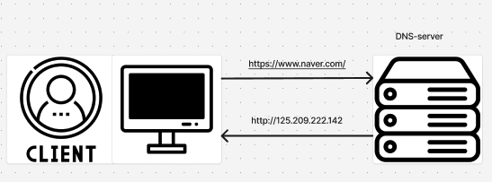
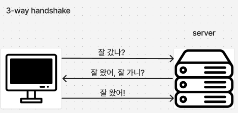
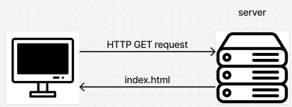
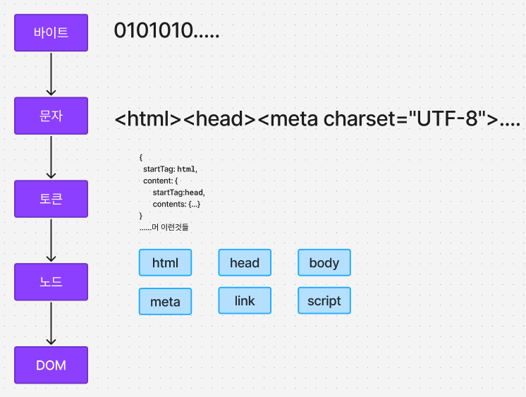
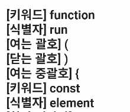
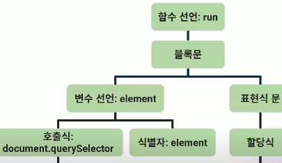
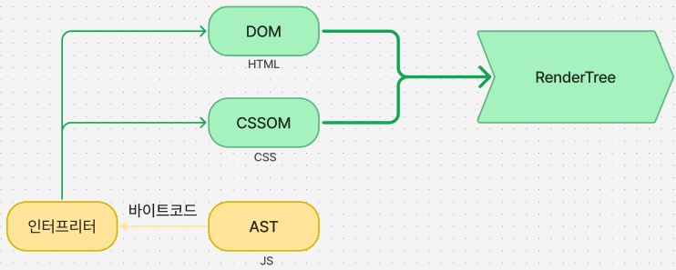
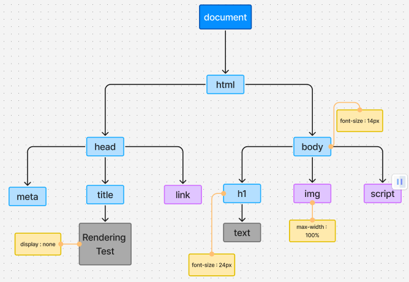
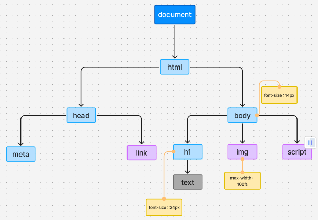
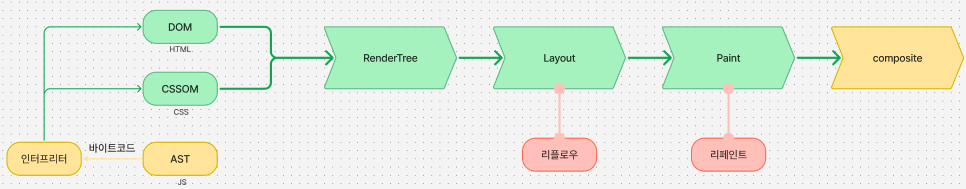

## 날짜: 2024-10-30

### 스크럼
- #### 오늘 할 일
express 과제 
커뮤니티 미니 페이지(3개) 
딥다이브
- #### 작일 한 일
커뮤니티 페이지 완료
- #### 작일 회고
생각보다 오래 걸린거같다. 아마 html을 구조적으로 짜지 못해서 그런것 같다.  
앞으로는 생각많이하고 코드짜기...

### 딥다이브
#### 주제 : 브라우저의 동작방식
- 🥺만약 네이버에 접속하여 페이지를 보고싶으면 어떻게 해야할까요?
### 1. Navigation
- 먼저 구글에 들어가서 url창에 naver.com을 치게 되겠죠? 그러면 저희의 컴퓨터는 DNS server라고 하는,  url에 해당하는 주소를 저장하고 있는 서버에 url을 전송하게 됩니다.

    

    이후 컴퓨터는 받은 ip로 HTTP 통신을 보내게 됩니다. 
    통신하기 전에! TCP 3-way handshake를 거치게 됩니다.

    

    패킷이 잘 오가는 것을 확인한 후 통신을 시작하는 것 입니다.  
***
### 2. Parsing
- 통신이 확인이 된 후 서버에 GET요청을 보내게 되고, (대부분의 서버는)index.html을 응답으로 받습니다.
    

    그 다음,  받아온 정적파일(index.html)을 브라우저의 렌더링 엔진이 HTML파싱하여 DOM과 CSSOM을 만들기 시작합니다.

 

**🎨DOM(document object model) 형성 과정**

1. 바이트 
처음 받아왔을때는 컴퓨터가 이해할 수 있는 언어인 이진 형태로 오게 됩니다.
2. 문자 
렌더링 엔진은 바이트를 문자로 변환하게 됩니다.
문자로 변환하는 과정에서 HTML 파일에 있는 meta태그의 인코딩 정보로 디코딩을 하게 됩니다.
3. 토큰 
이후 문자는 의미를 가진 최소 단위인 토큰으로 변환됩니다.
4. 노드 
토큰은 부모자식간의 관계를 가질 수 있는 노드로 변환하게 됩니다.
5. DOM 
노드를 토대로 트리 구조인 DOM트리를 형성하게 됩니다. 
  

 

**🎨CSSOM 형성과정**

- HTML을 파싱하는 중 <link>태그를 만나면, 브라우저는 href 속성에 명시된 리소스를 비동기적으로 다운로드합니다.
- CSS 파일일 경우, 클라이언트는 서버에 GET 요청을 보내 가져오며, 렌더링 엔진은 CSS 파싱을 시작합니다.
- HTML 파싱은 계속 진행되지만, CSS 파일이 로드될 때까지 렌더링은 일시적으로 차단될 수 있습니다. (렌더 블로킹)
1. 바이트
2. 문자
3. 토큰
4. 노드
5. CSSOM

(HTML 파싱과 동일한 과정으로 이루어집니다.)

***AST(abstract syntax tree)**

- 소스코드(js)의 구조와 의미를 트리 형태로 나타낸 것입니다.

1. 코드
2. 토큰 

3. AST 

javascript의 경우 렌더링 엔진이 아닌 자바스크립트 엔진이 관여하여 AST 구조로 만들게 됩니다.
 

### 3. Rendering
1. 파싱 과정을 통해 만든 DOM, CSSOM, AST를 결합하여 렌더트리를 만듭니다.
    

    렌터트리는 브라우저에 비표시되는 요소들은 포함이 되어있지 않습니다!({ display:none }같은 요소)

    
    (DOM,CSSOM 트리)
    
    (Render 트리)

2. 렌더 트리를 바탕으로 각 요소의 위치와 크기를 계산합니다.(레이아웃)
3. 최종적으로 계산된 레이아웃을 바탕으로 레이아웃 정보에 따라 요소의 색상, 텍스트, 이미지 등 실제 그래픽 요소를 그립니다.(페인팅)
4. 페인팅된 요소들을 각 레이어로 나누어 CPU를 통해 최종적으로 화면에 결합하여 표시합니다.(composite)

    

### 오늘의 도전 과제
- 도전 과제 1: 브라우저의 동작방식 설명하기

### 오늘의 회고
- 다른사람들에게 브라우저의 동작방식에 대해 설명하는 것을 준비하게 되면서 애매하게 알고있던 것을 다시 한번 조사하여 명확하게 알 수 있는 기회가 되었다.

